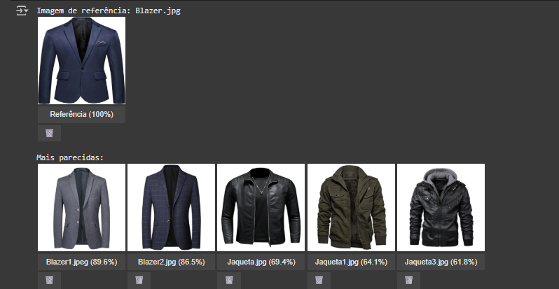

# 🖼️ Digital Image Recommendation System

## 🧠 Sistema de Recomendação de Imagens com Deep Learning

---

## 🏅 Badges

- 📦 Tamanho do repositório:  
  

- 📄 Licença do projeto:  
  

---

## 📋 Índice / Table of Contents

- [📖 Descrição / Description](#📖-descrição--description)   
- [⚙️ Funcionalidades / Features](#⚙️-funcionalidades--features)  
- [🚀 Execução / Execution](#🚀-execução--execution)  
- [🌐 Acesso / Access](#🌐-acesso--access)  
- [🧰 Tecnologias / Technologies](#🧰-tecnologias--technologies)  
- [👨‍💻 Desenvolvedor / Developer](#👨‍💻-desenvolvedor--developer)  
- [📜 Licença / License](#📜-licença--license)  
- [🏁 Conclusão / Conclusion](#🏁-conclusão--conclusion)

---

## 📖 Descrição / Description

**PT:**  
Este projeto demonstra como aplicar técnicas de visão computacional e aprendizado profundo para criar um sistema de recomendação de produtos com base em similaridade visual, utilizando o ambiente interativo do Google Colab. A aplicação permite:

📁 Fazer upload de imagens diretamente no Colab para compor o catálogo

🧠 Extrair vetores de características visuais com o modelo pré-treinado BIT (TensorFlow Hub)

💾 Armazenar os embeddings em cache para acelerar futuras execuções

🔍 Buscar produtos semelhantes por nome ou categoria textual

🖼️ Exibir recomendações visuais com botões interativos e imagens lado a lado

🗑️ Excluir ou restaurar itens do catálogo com controle manual

📊 Gerar matriz de similaridade entre categorias com visualização em heatmap

🎯 Explorar a distribuição dos produtos com gráficos PCA em 2D e 3D filtráveis por categoria

**EN:**  
This project demonstrates how to apply computer vision and deep learning techniques to build a product recommendation system based on visual similarity, using the interactive environment of Google Colab. The application allows you to:

📁 Upload images directly into Colab to build the product catalog

🧠 Extract visual feature vectors using the pre-trained BIT model (TensorFlow Hub)

💾 Cache embeddings to speed up future executions

🔍 Search for similar products by name or textual category

🖼️ Display visual recommendations with interactive buttons and side-by-side image comparisons

🗑️ Manually remove or restore items from the catalog

📊 Generate a category similarity matrix with heatmap visualization

🎯 Explore product distribution using PCA plots in 2D and 3D, filterable by category

---

## ⚙️ Funcionalidades / Features

| 🧩 Funcionalidade (PT)                      | 💡 Description (EN)                          |
|--------------------------------------------|----------------------------------------------|
| 📤 Upload interativo de imagens             | 📤 Interactive image upload                   |
| 🧠 Extração de embeddings com modelo BIT     | 🧠 Embedding extraction using BIT model       |
| 💾 Cache automático para acelerar execuções | 💾 Automatic caching for faster runs          |
| 🔍 Busca por nome ou categoria              | 🔍 Search by name or category                 |
| 🖼 Vitrine interativa com botões             | 🖼 Interactive gallery with buttons           |
| 🗑️ Exclusão e restauração de imagens        | 🗑️ Image deletion and restoration             |
| 📈 Heatmap de similaridade entre categorias | 📈 Category similarity heatmap                |
| 🎯 Visualização PCA 2D/3D por categoria     | 🎯 PCA 2D/3D visualization by category         |

---

## 🚀 Execução / Execution

**PT:**  
1. Faça upload das imagens via widget interativo  
2. O sistema extrai os vetores de características com o modelo BIT (TensorFlow Hub)  
3. As imagens são armazenadas em cache para acelerar futuras execuções  
4. A recomendação é feita com base na similaridade dos embeddings  
5. Visualize as imagens mais semelhantes com interatividade  
6. Explore a matriz de similaridade entre categorias  
7. Use PCA para visualizar a distribuição dos dados em 2D ou 3D

**EN:**  
1. Upload images via interactive widget  
2. Feature vectors are extracted using the BIT model (TensorFlow Hub)  
3. Images are cached for faster future runs  
4. Recommendations are based on embedding similarity  
5. View the most similar images interactively  
6. Explore category similarity matrix  
7. Use PCA to visualize data distribution in 2D or 3D

---

## 🌐 Acesso / Access

- [🔗 Notebook no Google Colab](https://colab.research.google.com/github/Rogerio5/Digital-image-recommendation-system-Project/blob/main/Digital_image_recommendation_system.ipynb)  
- [Repositório GitHub / GitHub Repository](https://github.com/Rogerio5/Digital-image-recommendation-system-Project)

---

## 🧰 Tecnologias / Technologies

  
  
  
  
  
  

 

---

## 👨‍💻 Desenvolvedor / Developer

- [Rogerio](https://github.com/Rogerio5)

---

## 📜 Licença / License

Este projeto está sob licença MIT. Para mais detalhes, veja o arquivo `LICENSE`.  
This project is under the MIT license. For more details, see the `LICENSE` file.

---

## 🏁 Conclusão / Conclusion

**PT:**  
Este sistema oferece uma abordagem prática e escalável para recomendação de imagens com base em similaridade visual. Ideal para aplicações em moda, e-commerce, curadoria de conteúdo ou análise de estilo.

**EN:**  
This system provides a practical and scalable approach to image recommendation based on visual similarity. Ideal for applications in fashion, e-commerce, content curation, or style analysis.
